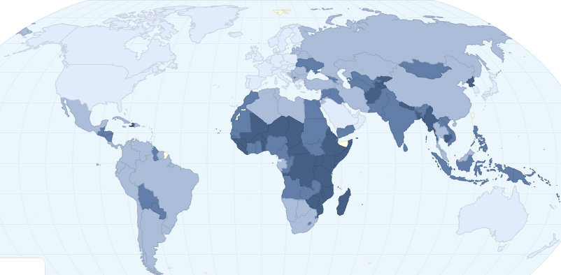

+++
# A Demo section created with the Blank widget.
# Any elements can be added in the body: https://sourcethemes.com/academic/docs/writing-markdown-latex/
# Add more sections by duplicating this file and customizing to your requirements.

widget = "blank"  # See https://sourcethemes.com/academic/docs/page-builder/
headless = true  # This file represents a page section.
active = true  # Activate this widget? true/false
weight = 10  # Order that this section will appear.

title = "Open Science in Developing Countries"
subtitle = "A Collection of Practical Guides"

[design]
  # Choose how many columns the section has. Valid values: 1 or 2.
  columns = "1"

[design.background]
  # Apply a background color, gradient, or image.
  #   Uncomment (by removing `#`) an option to apply it.
  #   Choose a light or dark text color by setting `text_color_light`.
  #   Any HTML color name or Hex value is valid.

  # Background color.
  # color = "#fefdf6"
  # color = "#69b3a2" # greenish
  
  # Background gradient.
  # gradient_start = "DeepSkyBlue"
  # gradient_end = "SkyBlue"
  
  # Background image.
  # image = "headers/bubbles-wide.jpg"  # Name of image in `static/img/`.
  # image_darken = 0.6  # Darken the image? Range 0-1 where 0 is transparent and 1 is opaque.
  # image_size = "cover"  #  Options are `cover` (default), `contain`, or `actual` size.
  # image_position = "center"  # Options include `left`, `center` (default), or `right`.
  # image_parallax = true  # Use a fun parallax-like fixed background effect? true/false

  # Text color (true=light or false=dark).
  text_color_light = false

[design.spacing]
  # Customize the section spacing. Order is top, right, bottom, left.
  padding = ["60px", "0", "60px", "0"]

[advanced]
 # Custom CSS. 
 css_style = ""
 
 # CSS class.
 css_class = ""
+++

 

{}

THIS IS A PAGE IN CONSTRUCTION. PLEASE COME BACK SOON!

{}

 

 

## *Overview*
---------------------

FORRT is excited to announce a collaboration with a new and significant project in our efforts to dismantle established hierarchies surrounding teaching, research, and service to foster a more inclusive academic environment through open science as well as foster principles of accessibility, diversity, equity, inclusion, belonging, and social justice in Open Science. 

This collaborative paper together with [the Chinese Open Science Network](https://open-sci.cn/), led by [Dr. Hu Chuan-Peng](https://huchuanpeng.com/) and team [(list of collaborators)](), is to be published in [Advances in Methods and Practices in Psychological Science (AMPPS)](https://www.psychologicalscience.org/publications/ampps), and aims to provide practical guidance and examples to promote Open Science practices in the developing world. 

Our FORRT community will support this initiative by leveraging and sharing our expertise in big-team science, community and project organization, and people-power.

 

### Why This Project Is Needed 
---------------------

Open Science has gained significant traction in developed countries and is endorsed by major organizations such as UNESCO, NASA, White House and other world players. However, the principles of Open Science—inclusing diversity, equity, inclusivity, and accessibility (DEIA)—are not fully realized in developing regions. Researchers in these countries face unique challenges, including limited resources, lack of infrastructure, and systemic barriers that hinder the adoption of Open Science practices. FORRT was established to empower early career scholars, particularly from low- and middle-income countries, by providing curated learning and teaching materials on Open Science. Since its inception, FORRT has advocated for integrating social justice principles in both research and teaching. This collaboration aligns with FORRT’s mission by addressing these challenges head-on, aiming to level the educational landscape and promote equity in scientific research globally.

This joint initiative with [the Chinese Open Science Network](https://open-sci.cn/) is a step towards realizing FORRT’s vision of an inclusive and equitable Open Science community, reflecting our commitment to accessibility, diversity, equity, inclusion, belonging, and social justice. [See this page in the COSN's website here](https://opensci-cn.github.io/OS-developing-world/).

 

### Project Details 
---------------------

This project will collect practical experiences and guidelines related to Open Science in developing countries. The main output will be a collaborative paper in AMPPS. We hope this project will accelerate international collaborations and help researchers in these regions implement Open Science practices effectively. Additionally, we aim to produce an open educational resource on promoting Open Science in developing countries. 

****Contributors****

- 49 contributors will cover Open Science related topic from perspective of 12 developing countries.

***[insert correct map here, to-be-done]***

 

#### Progress 
---------------------

- [x] Open call for contributors.

- [x] Identified topic leads.

- [x] Drafts for each topic.

- [x] First draft of the whole paper.

- [ ] Re-structure the first draft of the whole paper. [On-going]

 

#### Presentations & Upcoming Events 
---------------------

- 2023-10-23 ｜ Big Team Science Conference 2023 (online) | # 24 Featured Panel. See program [here](https://bigteamscienceconference.github.io/program/).

 

#### Call for Contributors
---------------------

We invite researchers, particularly those from developing countries or with strong connections to them, to contribute to this paper. We seek practical solutions and examples feasible for early career researchers in these regions. The paper will provide a practical guide for researchers and insights for policymakers, funders, and other stakeholders interested in promoting Open Science practices globally. Here's the full call ([.pdf download](Open_Science_Developing_Countries)). 

**Responsibilities**: 
* Contribute to one section of the paper by sharing experiences from your region. 
* Participate in virtual meetings to discuss progress and provide feedback. 
* Contribute to the collaborative process, with authorship roles determined based on content contributions. 

**Time Commitment**: Approximately 30-40 hours over 3-4 months. 

**How to Join**: If interested, please send a brief expression of interest, including your areas of expertise and relevant experience, to Dr. Hu Chuan-Peng at hcp4715@gmail.com. We welcome collaborators from various disciplines, including psychology, science and technology studies, development studies, public policy, and library and information science. 

 

## Contact Us
---------- 

For more information, please contact Dr. Hu Chuan-Peng (hcp4715@hotmail.com), School of Psychology, Nanjing Normal University, Nanjing, China and info@forrt.org.

 

 

 