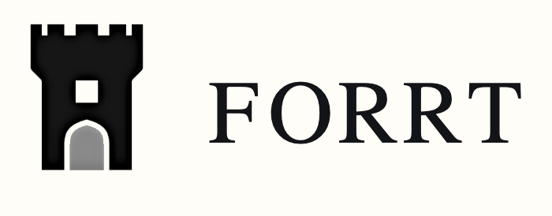

 
**FORRT Neurodiversity and Open Scholarship Lesson Bank**

\_\_\_\_\_\_\_\_\_\_\_\_\_\_\_\_\_\_\_\_\_\_\_\_\_\_\_\_\_\_\_\_\_\_\_\_

**This lesson bank has been developed by FORRT (Framework for Open and Reproducible Research) in order to promote Open Scholarship and Neurodiversity in academia. The materials raise awareness of some of the most recent debates relating to science and invite students engage in epistemological discussions and to reflect on the core values of Open Science.**

\_\_\_\_\_\_\_\_\_\_\_\_\_\_\_\_\_\_\_\_\_\_\_\_\_\_\_\_\_\_\_\_\_\_\_\_

  

Resources presented at a workshop titled "Neurodiversify your curriculum delivered by Lorna Hamilton, Magdalena Grose-Hodge, Mahmoud Elsherif & the FORRT group at the Unconference 2023: Open Scholarship Practices in Education Research. If you would like to provide feedback, please contact Magdalena Grose-Hodge (m.s.grose-hodge@bham.ac.uk)

  
  

**Resources:**

Click on the lesson materials to open a new window.

Lesson 1&2: [Implicit bias](/ND/implicitbias.html)

   [Implicit bias - Lesson Plan part 1](/ND/Lesson plans/implicit bias lesson plan.docx)

   [Implicit bias - Lesson Plan part 2](/ND/Lesson plans/Implicit Bias part 2.docx)

Lesson 3: [Diversity as one of the core values of Open Science](/ND/Community Psychology - Diversity.html)

   [Diversity as one of the core values of Open Science - Lesson Plan](/ND/Lesson plans/Diversity as a core value of Open Science.docx)

Lesson 4: [Diversity and research](/ND/Diversity and Research.html)

   [Diversity and research - Lesson Plan](/ND/Lesson plans/Diversity and Research.docx)

Lesson 5: [Oppression and Power](/ND/masterstools.html )

   [Oppression and Power - Lesson Plan](/ND/masterstools.docx)

Lesson 6: [Generalizability Crisis](generalizability.html)

   [Generalizability Crisis - Lesson Plan](/ND/Lesson plans/generalizability.docx)

Lesson 7: The myth of the normality How neurodiversity dismantles the generalisability crisis[Text 1](https://journalofethics.ama-assn.org/article/myth-normal-brain-embracing-neurodiversity/2015-04) [Text 2](https://www.cambridge.org/core/journals/behavioral-and-brain-sciences/article/abs/generalizability-crisis/AD386115BA539A759ACB3093760F4824)

   [The myth of the normality How neurodiversity dismantles the generalisability crisis - Lesson Plan](/ND/Lesson plans/The myth of the normality How neurodiversity dismantles the generalisability crisis.docx)

Lesson 8: [Neurodiversity Culture and Teaching - text](http://rapidintellect.com/AEQweb/ed-5971.pdf)

   [Neurodiversity Culture and Teaching - Lesson Plan](/ND/Lesson plans/Neuro_para.docx)

Lesson 9: [Avoiding ableist language to diversify OS - text](https://www.liebertpub.com/doi/10.1089/aut.2020.0014)

   [Avoiding ableist language to diversify OS - Lesson Plan](/ND/Lesson plans/Avoiding ableist language to diversify open scholarship.docx)

Lesson 10: How can Open Scholarship address structural ableism and racism? [Text 1](https://www.apa.org/science/about/psa/2019/02/open-science) [Text 2](https://www.tandfonline.com/doi/abs/10.1080/09638288.2023.2173315?journalCode=idre20)

   [How can Open Scholarship address structural ableism and racism? - Lesson Plan](/ND/Lesson plans/How can we Open Scholarship to address the structural ableism and racism in our society.docx)

[admin](/ND/h5p-standalone-1.3.x/demo/lhquestions.html)

[admin 2](/ND/h5p-standalone-1.3.x/demo/content-example-2.html)